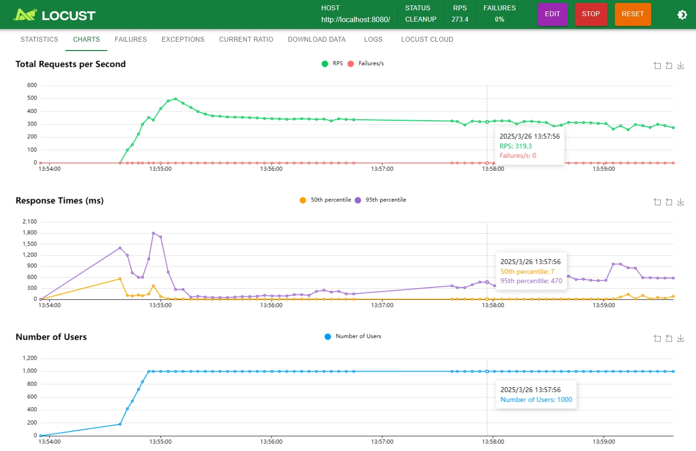

## Abstract
A simple bank transaction management system including CRUD operations.

## Tech Stack
* Programming language: Java 21 and Python 3
* Framework：Spring Boot
* Database：H2(memory)
* Cache：Spring Cache
* Toolchain：Maven
* Containerization：Docker, K8S
* Test: JUnit5, Locust

## External Library
* spring-boot-starter-web: Springboot web app fundamental.
* spring-boot-starter-validation: Param validation.
* spring-boot-starter-cache: Cache support.
* caffeine: Cache implementation.
* h2: Memory db.
* spring-boot-starter-test: Test support for springboot.
* junit-platform-launcher: Junit support.
* spring-boot-starter-data-jpa: ORM for springboot.
* lombok：Programming utility.
* springdoc-openapi-starter-webmvc-ui: Swagger.

## Deployment
### Local
```mvn package``` , then click run button in IDE. 
### docker
```
docker build -t transaction-management:v1.0 .
docker run -d -p 8080:8080 transaction-management:v1.0
```
### k8s
```
kubectl apply -f k8s-all-in-one.yml
```

## Swagger
Run the app locally, then access http://localhost:8080/api/swagger-ui/index.html#/


## 测试
### UT and IT
```
mvn test
```

### Code coverage

### Load test
Locust: An open source, Python-based performance testing tool for distributed and scalable load testing.

Install lib and run locust
```
pip install locust
locust -f load-test.py
```
Run the app locally, then access http://localhost:8089 . First, config the test and run, the target host is http://localhost:8080/

The result is here

